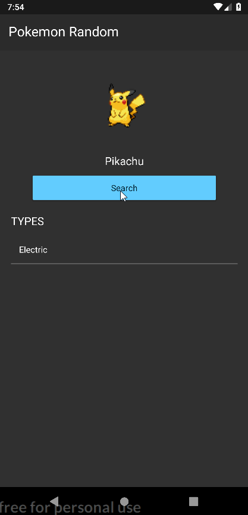

# Pokemon Random

Quick Nativescript practice app, using [PokéAPI].

## Nativescript Components Used

* `<ActionBar></ActionBar>`
* `<StackLayout></StackLayout>`
* `<Label></Label>`
* `<StackLayout></StackLayout>`
* `<Image></Image>`
* `<Button></Button>`
* `<ListView></ListView>`

## Demo

## License

MIT

[PokéAPI]: https://pokeapi.co/